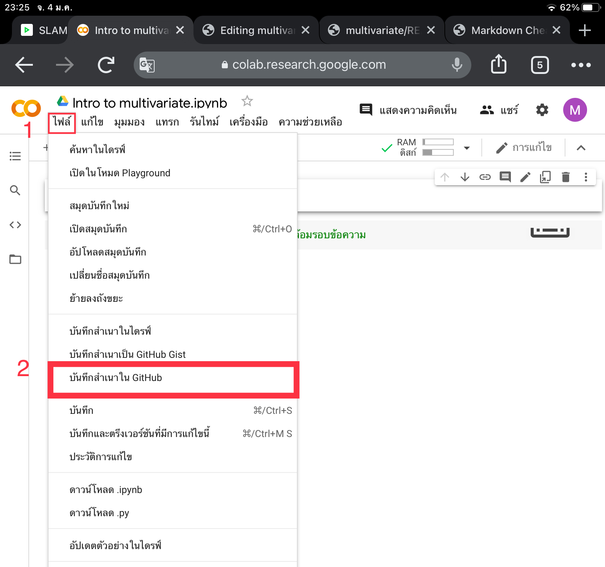
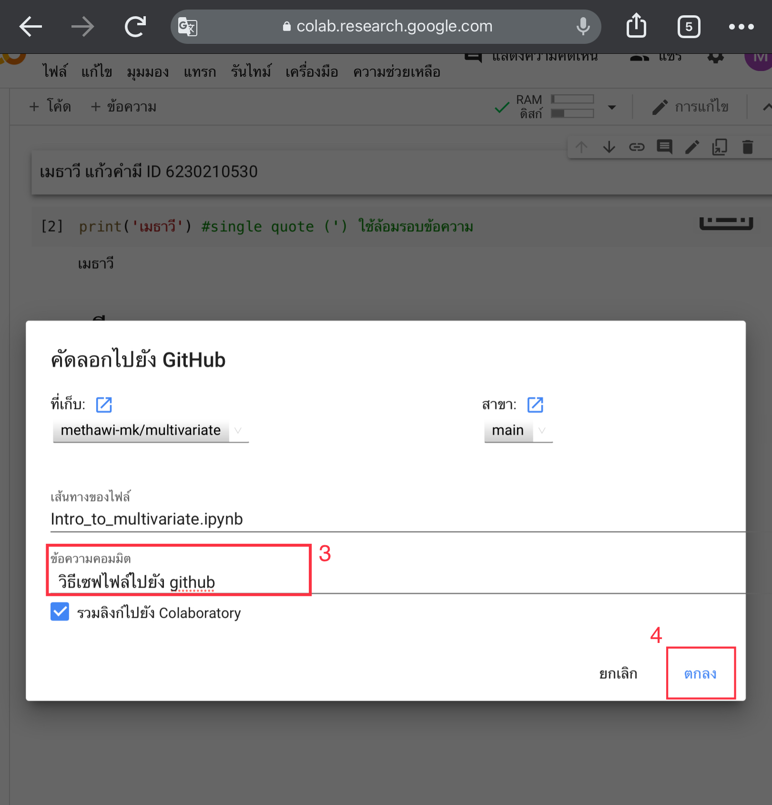

# multivariate

### เมธาวี ID 6230210530

.md => Markdown 

.[-]. square brackets

() parentheses

อธิบายการใช้งาน Github และ Google colab ว่าหน้าที่ของแต่ละอันคืออะไร และอธิบายวิธีเซฟไฟล์จาก Google colab ลงใน Github

Github มีหน้าที่ไว้เขียน markdown ต่างๆ และสามารถเขียนโค้ดหรือแก้ไขร่วมกับผู้อื่นได้ มีการให้ใส่ คอมมิทเพื่ออัปเดตทการทำงานว่าถึงไหนแล้ว

Google colab มีหน้าที่เขียน python ต่างๆ สามารถเซฟไฟล์จาก Google colab ลงใน Github ได้ 

การเซฟไฟล์จาก Google colab ลงใน Github ทำได้ดังนี้

1 คลิกไปที่ ไฟล์ 

2 เลือกไปที่ บันทึกสำเนาใน github (ดังรูปด้านล่าง)

3 เปลี่ยนแปลง คอมมิท เพื่ออัปเดทการทำงาน/แก้ไข

4 กด ตกลง (ดังรูปด้านล่าง)

เสร็จสิ้น
